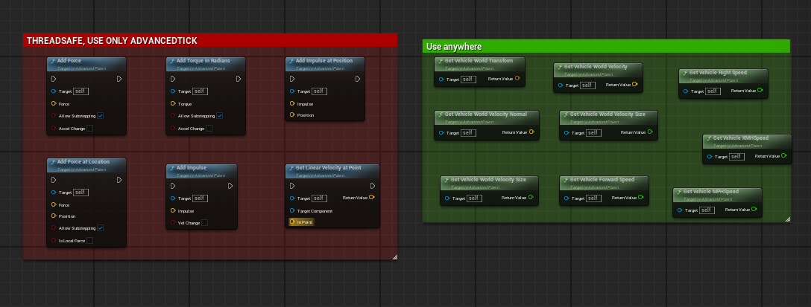
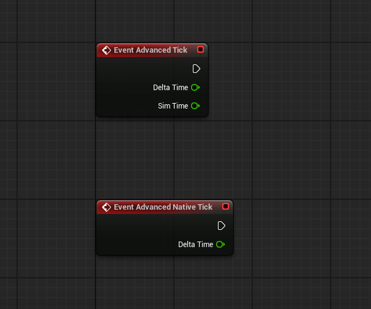
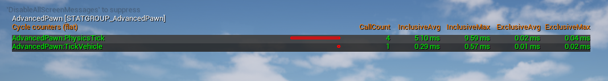
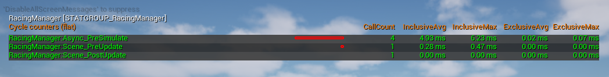
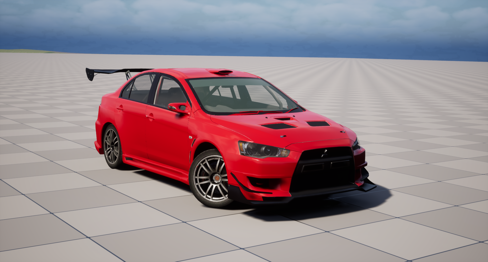

Advanced Physics Tick
=====================

<div align="center">

</div>

Advanced Physics Tick is a plugin for Unreal Engine 5 designed to work with asynchronous Chaos physics. It is specifically focused on vehicle simulation and includes a single UStaticMesh (VehicleMesh) that provides more robust and improved control over the physics model. This plugin is not a general-purpose plugin, but is designed with an emphasis on accurate and flexible motion simulation for Vehicles.

Setup
=====================

1. Clone or download the repository from GitHub:
```
git clone https://github.com/your-repo/AdvancedPhysicsTick.git
```
2. Place the plugin folder in the plugins directory of your Unreal Engine 5 project.
3. Run Unreal Engine 5 project.

Documentation
=====================

### 1. AddForce, AddForceAtLocation and etc...
Use these functions to interact with VehicleMesh in AAdvancedPawn:
```
UFUNCTION(BlueprintCallable, Category = "AdvancedPawn|Physics")
void AddForce(const FVector& Force, bool bAllowSubstepping = true, bool bAccelChange = false);
```
```
UFUNCTION(BlueprintCallable, Category = "AdvancedPawn|Physics")
void AddForceAtLocation(const FVector& Force, const FVector& Position, bool bAllowSubstepping = true, bool bIsLocalForce = false);
```
```
UFUNCTION(BlueprintCallable, Category = "AdvancedPawn|Physics")
void AddImpulse(const FVector& Impulse, bool bVelChange);
```
```
UFUNCTION(BlueprintCallable, Category = "AdvancedPawn|Physics")
void AddTorqueInRadians(const FVector& Torque, bool bAllowSubstepping = true, bool bAccelChange = false);
```
	> NOTE. THREADSAFE! CALL THIS FUNCTIONS ONLY AdvancedTick in BP or PhysicsTick in C++!

And you can use in Blueprints!
Blueprint graph implementation
<div align="center">

</div>

### 2. GetLinearVelocityAtPoint.
```
UFUNCTION(BlueprintCallable, Category = "AdvancedPawn|Physics")
FVector GetLinearVelocityAtPoint(const UPrimitiveComponent* TargetComponent, const FVector& InPoint);
```
#### Params:
-   `InComponent`: Component to which the force will be applied with bSimulatePhysics = true.
-   `InPoint`: Point.

	> NOTE. THREADSAFE! CALL THIS FUNCTION ONLY AdvancedTick in BP or PhysicsTick in C++!

### 3. AdvancedTick and AdvancedNativeTick.
You can override TickVehicle and PhysicsTick in your class for advanced physics logic:

```
virtual void TickVehicle(float DeltaTime) override;
```
#### Parameters:
-   `DeltaTime`: Delta = 1/60, userful for control wake/sleeping vehicle mesh, visual effects, sounds and animations.

```
virtual void PhysicsTick(UWorld* InWorld, float DeltaTime, float SimTime, Chaos::FRigidBodyHandle_Internal* InHandle) override;
```
#### Parameters:
-   `DeltaTime`: PhysicThread, userful for simulation and apply forces.
-   `SimTime`: Current simulation time.

Blueprint graph implementation
<div align="center">

</div>

### 3. Stat and Debugging
Unfortunately, you can't currently use DrawDebugHelpers in a physics thread, otherwise it will crash the UnrealEngine or cause HandledEnsure type errors.

For PhysicThread use in C++
Chaos::FDebugDrawQueue::GetInstance().DrawDebug.....

or for Blueprints use CVars AdvancedPawn

Stat command for drawing applied forces as lines and arrows.
```
p.RacingVehicle.AdvPawn.DrawAllForces 1
```
Automatically this CVar activates p.Chaos.Debug Draw.Enabled

Stat ```DECLARE_CYCLE_STAT``` Allows you to see in PIE the number of calls and the time taken in ms. Userful for debugging and profiling.

1. For AdvancedPawn calls AdvancedTick and AdvancedNativeTick
```
stat AdvancedPawn
```
<div align="center">

</div>

2. For AdvancedCallback calls ProcessInputs_Internal and OnPreSimulate_Internal
```
stat RacingManager
```
<div align="center">

</div>

Throbleshooting and TODO
=====================
There are no faults yet...

TODO:
1. Refix UAdvancedMovementComponent.
2. Realize AddForce for UPrimitiveComponents
3. More stabilize.

Where is it used?
=====================

1. NWheelVehicle project - Author: https://boosty.to/ivan_novozhilov

<div align="center">

</div>

<div align="center">

</div>

You can use this plugin anywhere and for free, except for those that do not comply with the Unreal Engine brand.